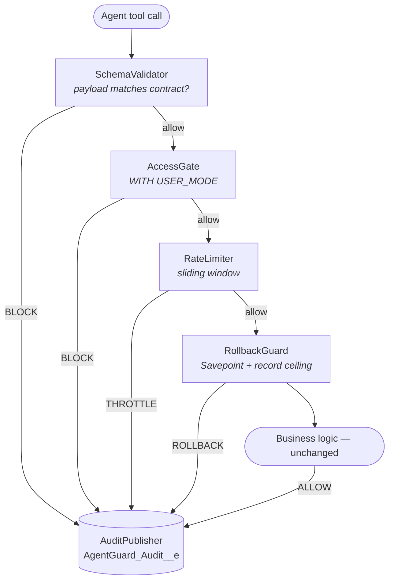

<div align="center">

# AgentGuard SF

**An open-source Apex security firewall between AI agents and your Salesforce data.**

Schema validation · CRUD/FLS enforcement · Rate limiting · Transactional rollback · Real-time audit

[](https://github.com/Yashraghuvans/AgentGuard/actions/workflows/ci.yml)
[](https://github.com/Yashraghuvans/AgentGuard/actions/workflows/codeql.yml)
[](sfdx-project.json)
[](LICENSE)
[](CONTRIBUTING.md)

[Why AgentGuard](#why-agentguard) · [How It Works](#how-it-works) · [Quick Start](#quick-start) · [Configuration](#policy-configuration) · [Threat Coverage](#threat-coverage) · [Docs](#documentation) · [Security](#security)

<br>

<a href="https://youtu.be/Q7kJB-wIn-0">
  
</a>

<sub>▶ <b>1-minute overview</b>: the problem, the five gates, the guarantees</sub>

</div>

---

> [!WARNING]
> **Beta.** The unlocked package is a beta build and has not been promoted for production. Evaluate it in scratch orgs and sandboxes only. See [Project Status](#project-status) for what remains before v1.0.

## Why AgentGuard

AI agents, including Agentforce, MCP-connected assistants, and custom LLM integrations, can now invoke Apex actions that read and write real business data. Three failure modes keep security teams from allowing it:

| Failure mode           | What happens without a guard                                                                                                        |
| ---------------------- | ----------------------------------------------------------------------------------------------------------------------------------- |
| **Prompt injection**   | An instruction hidden in a record, email, or knowledge article causes an agent to issue an action nobody asked for                  |
| **CRUD/FLS bypass**    | Apex invocables run in system context by default, so an agent can read or mutate fields its user was never permissioned to touch    |
| **Unaudited mutation** | A misbehaving agent fires DML in a loop with no throttle, no rollback boundary, and no real-time record of what it did              |

Existing Salesforce controls operate at other layers. The **Einstein Trust Layer** governs prompts, and **Agentforce Command Center** reports outcomes after the fact. Neither enforces anything *at the moment an Apex action executes*.

**AgentGuard SF is that enforcement layer.** It wraps any `@InvocableMethod` with a single check and treats every agent-issued call as untrusted input until it passes five gates.

## Key Features

- **Five-gate enforcement chain.** SchemaValidator, AccessGate, RateLimiter, RollbackGuard, and AuditPublisher run in a fixed order on every wrapped call.
- **Real running-user access control.** CRUD/FLS checks run `WITH USER_MODE` against the actual invoking user, never an elevated or claimed context.
- **Declarative policies.** Schema contracts, rate budgets, profile/permission-set scoping, and record ceilings live in `Guard_Policy__mdt`, so you can tune them without an Apex deployment.
- **Transactional safety.** A Savepoint boundary and a per-call record ceiling stop bulk-injection attacks from leaving partial state.
- **Real-time observability.** A Lightning dashboard and an `sf agentguard` CLI plugin both stream the same `AgentGuard_Audit__e` events live.
- **Zero runtime dependencies.** The core enforcement path makes no external callouts and depends on no managed packages.

## How It Works

Every wrapped call passes through the same chain, in the same order.



Every decision (ALLOW, BLOCK, THROTTLE, or ROLLBACK) publishes an `AgentGuard_Audit__e` Platform Event with the actor, payload hash, reason, and timestamp. A rejected call is never a silent failure.

### Design Guarantees

| Guarantee                     | Mechanism                                                                                                            |
| ----------------------------- | -------------------------------------------------------------------------------------------------------------------- |
| **Fail closed**               | An exception inside any gate results in BLOCK, never ALLOW (see the documented exception below)                      |
| **Restrictive by default**    | Every policy field defaults to its most restrictive safe value; nothing is permitted unless explicitly configured    |
| **Running-user context only** | Access checks evaluate the real user, never an elevated or agent-claimed context                                     |
| **Audit survives rollback**   | Decisions publish as Platform Events, outside the transaction's rollback boundary                                    |
| **Kill switch**               | Setting `IsActive__c = false` on a policy blocks every call to that action immediately                               |

> [!IMPORTANT]
> **Documented exception: RateLimiter and Platform Cache.** If the `AgentGuard` Platform Cache partition is missing, RateLimiter **fails open**. It allows the call and flags the audit event, rather than blocking every agent action in the org. All other gates still enforce. Create the partition during setup (see [Quick Start](#quick-start)) and alert on flagged audit events.

## Quick Start

### Prerequisites

| Requirement                  | Notes                                                              |
| ---------------------------- | ------------------------------------------------------------------ |
| Salesforce CLI (`sf`) v2+    | `npm install -g @salesforce/cli`                                   |
| Dev Hub org                  | Enterprise, Performance, or Unlimited Edition with Dev Hub enabled |
| API version 62.0+            | Set in `sfdx-project.json`                                         |

### 1. Install

**Option A: beta unlocked package** (scratch orgs and sandboxes only)

```bash
sf package install --package 04tXXXXXXXXXXXXXXX --target-org my-sandbox --wait 10
```

**Option B: deploy from source**

```bash
git clone https://github.com/Yashraghuvans/AgentGuard.git
cd AgentGuard
sf org create scratch --definition-file config/project-scratch-def.json --alias agentguard-dev
sf project deploy start --target-org agentguard-dev
```

### 2. Create the Platform Cache partition

In **Setup → Platform Cache → New Platform Cache Partition**, create a partition named `AgentGuard` with at least 1 MB of capacity. RateLimiter needs this partition to enforce budgets.

### 3. Wrap an action

Add one check before your existing business logic. You don't need to refactor the surrounding code:

```apex
public with sharing class UpdateAccountTerritoryAction {

    @InvocableMethod(label='Update Account Territory')
    public static List<Result> execute(List<Request> requests) {

        GuardResult check = AgentGuard.wrap(
            'UpdateAccountTerritory',   // policy name → Guard_Policy__mdt
            JSON.serialize(requests)    // raw, untrusted AI-originated payload
        );

        if (!check.isAllowed) {
            throw new AgentGuard.BlockedException(check.reason);
        }

        // Existing logic runs unchanged, now validated, access-checked,
        // rate-limited, inside a Savepoint boundary, and audited.
        return TerritoryService.reassign(requests);
    }
}
```

If your business logic itself can throw, use `AgentGuard.wrapAndExecute`. It rolls back to the savepoint automatically. See [Getting Started](docs/getting-started.md) for both patterns.

## Policy Configuration

Each wrapped action is governed by one `Guard_Policy__mdt` record. The `DeveloperName` must match the name passed to `AgentGuard.wrap()`.

| Field                       | Description                                    | Example                  |
| --------------------------- | ---------------------------------------------- | ------------------------ |
| `DeveloperName`             | Matches the name passed to `AgentGuard.wrap()` | `UpdateAccountTerritory` |
| `IsActive__c`               | Master kill switch; `false` blocks all calls   | `true`                   |
| `TargetSObjectType__c`      | SObject the action reads or writes             | `Account`                |
| `Operation__c`              | `READ`, `CREATE`, `MODIFY`, or `REMOVE`        | `MODIFY`                 |
| `SchemaContract__c`         | JSON schema used to validate the payload       | see docs                 |
| `MaxRecordsPerCall__c`      | Hard ceiling on DML rows per call              | `10`                     |
| `RateLimitPerMinute__c`     | Maximum calls per user per window              | `30`                     |
| `RateLimitWindowSeconds__c` | Sliding window length (10–3600 s)              | `60`                     |

Because policies are custom metadata, they are versioned, code-reviewed, and deployed like any other metadata. Full field reference, schema contract format, and worked examples are in [Policy Configuration](docs/policy-configuration.md).

## Monitoring

You can watch decisions in real time from either surface. Both read the same `AgentGuard_Audit__e` stream.

The **Lightning dashboard** (`guardAuditDashboard`) can be added to any Lightning page. The **CLI plugin** streams events from a terminal:

```bash
sf agentguard audit tail --target-org myorg
```

Installation and the full command reference are in the [CLI plugin README](plugins/sf-agentguard/README.md).

## Threat Coverage

| STRIDE category                                                           | Mitigating component                                                          |
| ------------------------------------------------------------------------- | ----------------------------------------------------------------------------- |
| **Spoofing:** agent claims a higher-privileged context                    | `AccessGate` evaluates the real running-user context only                     |
| **Tampering:** injected payload reshaped into out-of-contract mutation    | `SchemaValidator` rejects payloads that violate the declared contract         |
| **Repudiation:** destructive call with no record                          | `AuditPublisher` logs every decision with actor, payload hash, and timestamp  |
| **Information disclosure:** fields the user cannot see                    | `AccessGate` strips or blocks inaccessible fields on read paths               |
| **Denial of service:** flooded actions exhausting limits                  | `RateLimiter` enforces per-user, per-action sliding-window budgets            |
| **Elevation of privilege:** partial bulk mutations leave inconsistent state | `RollbackGuard` Savepoint boundary and record ceiling                       |

The full model is in [Threat Model](docs/threat-model.md), and known limitations are tracked in the [Risk Register](docs/risk-register.md).

### What AgentGuard Does Not Do

These are deliberate scope boundaries. Details are in [LIMITS.md](LIMITS.md).

- **It is not a prompt-level control.** It does not mask data sent to an LLM. Pair it with the Einstein Trust Layer at the prompt boundary.
- **It is not a scanner.** It governs only actions that opt in via `AgentGuard.wrap()`. Unwrapped invocables are not protected.
- **It does not detect injection semantically.** Enforcement is structural (schema, access, volume), not a content classifier.
- **Rate-limit state is not durable.** Platform Cache counters can reset on eviction.
- **Policies do not sync across orgs.** They deploy per org like any metadata.

## Testing & Quality

Every gate has both ALLOW and BLOCK tests. For a security tool, a suite that only proves calls succeed is not enough, so each gate has at least one negative test proving it rejects a bad payload.

```bash
sf apex run test --target-org agentguard-dev --code-coverage --result-format human --wait 30
```

| Metric             | Current       | v1.0 target |
| ------------------ | ------------- | ----------- |
| Automated tests    | 117 passing   | —           |
| Packaged coverage  | 83%           | ≥ 90% on `core/` |
| Org-wide coverage  | 75%           | —           |

Every pull request runs lint, PMD static analysis, scratch-org unit tests, and a coverage gate. The coverage matrix mapping each threat to its tests is in [Testing](docs/testing.md).

## Documentation

| Document                                            | Contents                                            |
| --------------------------------------------------- | --------------------------------------------------- |
| [Getting Started](docs/getting-started.md)           | Install, first wrap, first blocked call             |
| [Architecture](docs/architecture.md)                 | Component diagram, request lifecycle, ADR summaries |
| [Policy Configuration](docs/policy-configuration.md) | Full `Guard_Policy__mdt` field reference            |
| [API Reference](docs/api-reference.md)               | Public method signatures                            |
| [Threat Model](docs/threat-model.md)                 | STRIDE analysis mapped to components                |
| [Risk Register](docs/risk-register.md)               | Known limitations and mitigations                   |
| [Testing](docs/testing.md)                           | Coverage matrix mapping threats to tests            |
| [Compliance Mapping](docs/compliance.md)             | SOC 2 / GDPR / HIPAA evidence contributions         |

## Project Status

AgentGuard SF is in **beta**. All five gates, declarative policies, the audit dashboard, and the CLI plugin are implemented. The remaining work for **v1.0** is:

- Raise `core/` coverage to at least 90%
- Promote the unlocked package for production installs
- Publish the hosted documentation site

Release history is in [CHANGELOG.md](CHANGELOG.md).

## Contributing

Contributions are welcome. Read [CONTRIBUTING.md](CONTRIBUTING.md) for setup, branch strategy, and review expectations. Governance and decision-making are described in [GOVERNANCE.md](GOVERNANCE.md).

> **AI coding agents:** read [AGENTS.md](AGENTS.md) before making changes. It defines the non-negotiable boundaries of this repository.

## Security

AgentGuard SF is a security tool, so vulnerability reports are the highest-priority work in this repository.

**Do not open public issues for suspected vulnerabilities.** Report them privately through [GitHub Security Advisories](https://github.com/Yashraghuvans/AgentGuard/security/advisories/new). Response targets and the full disclosure process are in [SECURITY.md](SECURITY.md).

## License

Released under the [MIT License](LICENSE). It is free for commercial and enterprise use.

<div align="center">
<sub>Built and maintained by <a href="https://github.com/Yashraghuvans">Yash Raghuvanshi</a></sub>
</div>
